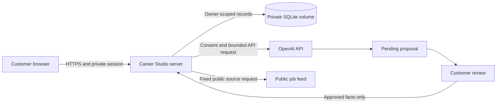

# Career Studio: engineer and product handoff

**Start here when this package becomes the GitHub repository.** Updated September 9, 2026. Package version 0.1.0.

This repository contains the working program and the instructions for turning it into a commercial SaaS product. It also specifies a future delivery option for customers who want to use their own ChatGPT access. The Fable presentation theme, current dashboard styling, and interviews for any skill are included.

**Current release status:** a working pilot foundation. The source includes an OpenAI API adapter, accounts, guided interviews, saved profiles, resume export, job assessments, an application tracker, and a simulated demo. Billing, a ChatGPT plugin, a desktop subscription companion, and a production deployment are not implemented. The latest local application suite passed 92 tests on September 9. Those tests use simulated providers and do not establish production security or live AI quality.

## 1. What we are building and selling

Career Studio helps a person explain their actual experience, create a resume they can support in an interview, evaluate job requirements, and organize applications.

Customers start from a blank profile or upload a PDF, DOCX, or TXT resume. The interviewer goes deeper on **every skill**, including AI, accounting, programming, Excel, trades, and unfamiliar custom skills. It asks about tasks, tools, personal contribution, help, recent use, and real examples. Naming a skill does not imply proficiency. Preserve independent work, assisted work, and learning as separate levels.

Real account holders can choose any skill, answer prepared follow-up questions, and save the interview without an API key, AI consent, or remaining AI allowance. This guided mode uses no external AI and creates no automatic skill levels, profile claims, or proposals. Saved answers and question progress survive reloads; repeating the same recorded request does not duplicate the answer. Add confirmed details manually in Your story. Enabling optional AI later shares saved interview history as well as new answers under the consent described on screen.

The customer reviews proposed facts before they enter the profile, reviews the profile before generating a resume, and approves a document version before using it. Job assessments explain supported experience, gaps, and unknowns. Customers submit applications themselves.

Sell the reviewed career workspace and useful search workflow. Do not promise a job, guaranteed interviews, universal ATS results, verified abilities, unlimited AI, or complete job coverage. Use [Sales playbook](docs/SALES_PLAYBOOK.md) for the pitch and demo. The first audience and pricing are hypotheses to validate in a controlled pilot.

## 2. Choose the delivery model explicitly

| Delivery | Customer receives | AI access | Current status |
| --- | --- | --- | --- |
| **Hosted SaaS: launch path** | Career Studio website, private account, resume builder, job reviews, tracker | The business’s server-side OpenAI API account | Program implemented; hosting, live validation, security gates, and billing remain. |
| **ChatGPT plugin: customer-access target** | A Career Studio plugin used inside ChatGPT, connected to their Career Studio account | The customer uses ChatGPT in their own account; backend tools store and retrieve their Career Studio data | Implementation instructions included; MCP server, OAuth connection, plugin package, review, and end-to-end validation still need building. |
| **Desktop companion: optional research path** | A locally installed Career Studio interface using an official Codex-managed sign-in | Customer’s eligible ChatGPT/Codex access | Not built; confirm production support and commercial suitability before committing to this release path. |

OpenAI documents subscription sign-in separately from Platform API usage. A customer’s ChatGPT subscription is not a credential to substitute into this program’s Responses API requests. [Official authentication guidance](https://learn.chatgpt.com/docs/auth).

The recommendation is to ship and validate the hosted API-backed product first, then implement the ChatGPT plugin if customers want to work inside ChatGPT. Keep a native desktop harness as a separate decision. The official App Server documentation describes managed ChatGPT login, but also warns that the app-server command and WebSocket transport are experimental and unsupported for production workloads. The existence of a login flow alone is not a production release approval. [Official App Server documentation](https://learn.chatgpt.com/docs/app-server).

Detailed implementation, customer onboarding, billing boundaries, and acceptance checks are in [Customer subscription delivery](docs/CUSTOMER_SUBSCRIPTION_DELIVERY.md). This is a build specification, not a claim that the connection already works.

## 3. What is in this package

| Path | Purpose |
| --- | --- |
| `server.js`, `lib/`, `public/` | Standalone program, shared profile rules, API adapter, interface, and fictional demo. |
| `package.json`, `package-lock.json` | Runtime requirements, pinned dependencies, commands. |
| `tests/` | Unit, security-boundary, document, provider, backup, and browser checks. |
| `Dockerfile`, `.dockerignore`, `.github/workflows/ci.yml` | Container and GitHub checks. These still require validation on the destination host. |
| `.env.example` | Configuration names and placeholders; no production credentials. |
| `scripts/backup.js` | Consistent SQLite backup command. Scheduling, encryption, and off-host storage are operator work. |
| [Engineering guide](docs/ENGINEERING_HANDOFF.md) | Architecture, invariants, implementation limits, and ordered launch backlog. |
| [SaaS business and release plan](docs/SAAS_BUSINESS_PLAN.md) | API setup, product packaging, cost controls, billing work, customer delivery, and commercial release gates. |
| [Security instructions](docs/SECURITY.md) | Current controls, threat boundaries, hardening work, verification, and incident response. |
| [Operations](docs/OPERATIONS.md) | Environment setup, container deployment, HTTPS, backup/restore, data retention. |
| [Customer subscription delivery](docs/CUSTOMER_SUBSCRIPTION_DELIVERY.md) | ChatGPT plugin implementation and optional local companion research. |
| [Design handoff](docs/DESIGN_HANDOFF.md), `docs/design/` | Fable’s theme, dashboard design settings, and reusable artwork. |
| [Pitch deck: PowerPoint](docs/CAREER_STUDIO_HANDOFF_2026-09-09.pptx), [PDF](docs/CAREER_STUDIO_HANDOFF_2026-09-09.pdf) | Editable 29-slide visual overview. The current written engineering and security guides also document the newer guided-interview behavior. |

## 4. Create the repository and run the program

Unzip the source package into a fresh directory and make **its contents** the root of a new private GitHub repository. Do not import the parent personal job-search repository or its history. Inspect the file list before the first commit. Keep `.env`, credentials, live databases, backups, customer documents, personal research, `node_modules`, and browser traces out of Git.

Use Node.js 24 or newer. From the new repository root:

```sh
npm ci
cp .env.example .env
npm run check
npm run test:unit
npx playwright-core install chromium
npm run test:browser
npm start
```

Open `http://127.0.0.1:4174/demo` for the fictional preview, or `/` for the actual account flow. The demo requires no account or API key and resets its edits on reload. Account/profile/resume/tracker functionality and the real account’s guided interview work without an AI key. The saved guided interview is distinct from the disposable scripted demo. Browser tests use temporary accounts and local services.

To enable real AI, privately configure `OPENAI_API_KEY` and a model available to the business’s API project as `OPENAI_MODEL`, then restart. Never distribute the business key to customers or put it into JavaScript, GitHub, a Docker layer, a screenshot, or a support ticket. Do not assume a sample model string proves availability.

Build the container and run the GitHub checks in the receiving environment. Keep their results with the release record. See [Operations](docs/OPERATIONS.md) for the actual deployment commands; local preview settings are not production settings.

## 5. Hosted SaaS architecture and invariants



Guided interview requests stay within the server and private database; they bypass the OpenAI branch and AI allowance counters. They retain authentication, CSRF checks, request bounds, and a separate account-level rate limit.

The server controls ownership and validates every write. AI output cannot grant permissions, run commands, choose an account owner, submit an application, or bypass customer review. Preserve source evidence, task-level assistance, revision checks, approved resume versions, request replay handling, and consent cancellation.

Deploy one application process with a private persistent SQLite volume and an HTTPS reverse proxy. Do not scale by copying the process or placing SQLite on a shared network drive. Shared storage, queues, limits, migrations, and recovery must be designed before multiple replicas.

## 6. Security work required before release

The included controls are a starting point. The engineer must complete and record the [security release checks](docs/SECURITY.md) on the actual host.

- Protect accounts and tenant boundaries. Confirm two users cannot access each other’s profiles, proposals, documents, applications, or exports. Resolve email verification, account recovery, and support identity handling before broad self-service release.
- Protect secrets and storage. Use a dedicated API project/service identity, restricted production access, encrypted storage and backups, tested rotation, and no sensitive request bodies in logs.
- Protect the HTTP boundary. Set the exact production origin, secure sessions, CSRF/origin protections, trusted proxy peers, upload limits, TLS, private app port, and edge abuse controls. Verify them externally.
- Protect parsing and AI. Keep uploads, postings, and model text untrusted. Preserve resource limits and review steps; harden document parsing beyond a worker thread before accepting broad untrusted traffic.
- Bound abuse and spend. Enforce server-side entitlements and quotas, limit accumulated stored data, monitor cost and usage, and retain an operator shutdown path. Existing request counts are not dollar caps.
- Operate recovery. Rehearse backup restoration, session revocation, account deletion reconciliation, a bad release rollback, and incident communication with assigned owners.
- Review the release supply chain. Scan dependencies and container contents, protect GitHub branches and deployment credentials, and distribute signed/verifiable artifacts where applicable. Resolve critical findings before release.

For customer-subscription integrations, add a separate threat model: OAuth/token scopes and revocation, customer identity mapping, MCP request isolation, prompt injection through external content, and explicit customer approval for writes. A local companion must also isolate its runtime, credential store, IPC, filesystem access, and update mechanism.

## 7. Turn the pilot into a business

Follow [SaaS business and release plan](docs/SAAS_BUSINESS_PLAN.md). The ordered milestones are:

1. **Reproduce:** clean checkout, complete checks, usable demo, explicit implementation inventory.
2. **Validate:** real API behavior, realistic resumes across skill domains, source rights, HTTPS hosting, security gates, monitoring, and tested restore.
3. **Pilot:** small invited cohort, recorded usefulness, friction, claim corrections, support burden, and cost per active customer.
4. **Charge:** tested billing and server-side entitlements, published limits, cancellation/refunds, support and privacy commitments, and positive measured economics for the chosen offer.
5. **Expand:** broader permitted job coverage, optional ChatGPT plugin, and scale only when customer evidence warrants it.

Hosting, job data, payment processing, storage, and support remain business costs even when a future customer uses their own ChatGPT account. If the plugin invokes the business’s API-backed AI endpoints, those calls still cost the business; design this choice explicitly and disclose it.

## 8. What the end user receives

For the SaaS release, provide a stable HTTPS URL, account onboarding, an accurate explanation of AI/data processing, recovery instructions, a first-resume walkthrough, document downloads, export/deletion controls, visible usage limits, and a reachable support channel. Paid customers also need receipts, billing management, cancellation, and clear service terms. They do not install Node or receive a source ZIP to use the hosted service.

For the future ChatGPT integration, provide the approved install/connection entry, supported-account requirements, Career Studio account linking, a consent screen, a guided first skill interview, review controls, and disconnect/revoke instructions. For a future local companion, provide a signed installer, supported OS/runtime requirements, official sign-in, local-data controls, secure updates, and uninstall instructions. Test each of these flows before advertising that edition.

## 9. Release evidence to leave for the next engineer

Record the release commit/tag and artifact checksum, CI run, deployment configuration without secret values, security review findings and resolutions, restore test, live AI evaluation, source-permission decision, customer-facing documents, and rollback/incident owners. Recheck dated official integration guidance before implementing or releasing a subscription edition.

Refresh the source ZIP after changes. It must include this file, the program, all linked guides, the current themed deck, and `docs/design/`, with no runtime data or credentials. This handoff provides implementation instructions; it does not certify a production deployment as safe or claim that unbuilt features have shipped.
