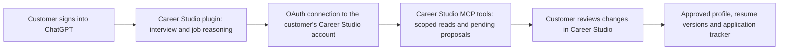

# Customer subscription delivery plan

Status: September 9, 2026. **The local companion is an implemented experimental prototype; the ChatGPT plugin below remains implementation work for the next engineer.** The hosted browser product uses the operator's OpenAI API account. Local mode uses official Codex-managed ChatGPT sign-in and has no API fallback. The account-free demo uses scripted replies. The written guides supersede the deck's older companion-research and guided-interview status.

The product objective is to let a customer use their own ChatGPT access for the career interview and job-search reasoning while Career Studio supplies the durable profile, resume versions, job records, and tracker. The local prototype keeps the conversation in our interface on the customer's computer. The proposed plugin would instead work inside ChatGPT. Neither path converts subscription access into Platform API credits, and the local prototype is not a hosted SaaS authentication mechanism.

Use [Local companion](LOCAL-COMPANION.md) for the implemented adapter, startup instructions, Codex 0.153.4 pin, restrictions, and live-pilot gates. Its dashboard sign-in flow and process lifecycle are implemented; only no-login real-runtime initialization, ephemeral thread creation, unsubscribe, and cleanup have been verified against the installed runtime. Actual eligible-account inference requires a consenting-user pilot.

## Future delivery: Career Studio inside ChatGPT

Build a Career Studio plugin containing interview workflow instructions and a remote MCP server. ChatGPT conducts the conversation; the server provides controlled access to the customer’s Career Studio records. The existing dashboard remains their full workspace. An optional embedded component can display a profile review or resume preview using the current theme; the first implementation can send customers to the authenticated dashboard for review.

OpenAI documents plugins that combine skills, MCP tools, and optional UI. Those capabilities can vary by host surface. This makes a plugin an implementation target, not evidence that Career Studio is already available or that every customer plan supports it. [Plugin architecture](https://developers.openai.com/plugins/concepts/plugins)

**The OAuth connection grants access to Career Studio. It does not hand our server the customer’s OpenAI subscription credentials.** Never ask for OpenAI passwords, cookies, auth-cache files, copied bearer tokens, or API keys in this flow. ChatGPT remains the host doing model work under the customer’s available access and limits. Confirm supported plans, workspace policies, regions, and host surfaces in the pilot rather than promising universal access.

The MCP path must not call `lib/ai.js`, `/api/interview`, `/api/jobs/assess`, or the AI tailoring branch of `/api/resumes`. Those routes invoke the operator-funded provider. Wrapping them as plugin tools would retain our API bill. Retain deterministic extraction, profile validation, public-feed retrieval, document generation, and storage. If operator-funded AI remains an alternative, label and authorize that alternative separately; never silently switch when the customer reaches a ChatGPT limit.

## Engineer implementation order

The following are Career Studio design requirements, not claims that the current package implements them.

1. **Establish the supported host and release gate.** Test the intended ChatGPT surface and a real eligible customer account using a private development connection. Record plan/workspace restrictions and the distribution route. Obtain the necessary publication access before advertising public availability. Freeze the supported tool/protocol versions for the pilot.

2. **Extract reusable application services.** Separate ownership checks, profile revisions, proposal validation, resumes, and application writes from HTTP route handlers. Both browser routes and MCP tools must call those services. Preserve the current tests; add tests proving the new path can run with `OPENAI_API_KEY` absent and that no model-provider request leaves our backend. Move evidence/proposal validation out of the provider adapter where necessary; never replace it with trust in model instructions.

3. **Add a dedicated OAuth integration.** Use a maintained authorization server/library. Map its verified issuer and subject to an existing Career Studio account through an authenticated account-linking step; never merge accounts because an unverified email matches. Start with narrow proposed scopes such as `profile:read`, `proposals:create`, `resumes:read`, and `applications:write`. Scope names are our design, not OpenAI-defined permissions.

   OpenAI’s current connection requirements include protected-resource metadata, authorization-server metadata, authorization code with PKCE S256, the canonical resource/audience, per-tool authorization declarations, and supported client identification/registration. Use the exact redirect URI shown by the management interface. Implement the documented authorization challenge so linking and reauthorization actually appear. [Plugin authentication](https://developers.openai.com/plugins/build/auth)

   Validate signature, issuer, audience, expiry, granted scopes, account status, and revocation on every private call. Issue short-lived Career Studio credentials with rotation/revocation appropriate to the chosen provider. Keep browser cookies and MCP access tokens separate. Reject model-supplied owner IDs.

4. **Implement a small, explicit tool surface.** Proposed contracts:

   | Tool | Behavior and boundary |
   | --- | --- |
   | `get_career_profile` | Return only requested sections and the current revision for the authenticated owner. |
   | `get_skill_questions` | Use the shared model’s task catalog and custom-skill questions; no inferred proficiency. |
   | `record_interview_answer` | Store the customer’s supplied answer with provenance; mark it unreviewed. |
   | `propose_profile_changes` | Validate evidence against recorded answers; create pending proposals bound to a revision. |
   | `search_job_listings` | Return allowed-source listings and attribution; preserve delay and uncertainty notices. |
   | `save_job_assessment` | Store a ChatGPT-produced draft with requirement/evidence references, gaps, and unknowns. |
   | `create_resume_draft` | Generate from reviewed profile data, or store validated suggested wording as an unapproved draft. |
   | `save_application` | Save the explicitly selected posting, stage, notes, and valid owned resume reference. |

   Mark answers relayed by the model as model-submitted, unreviewed material; do not claim they are independently authenticated chat transcripts. Show the quoted evidence for customer confirmation. Do not expose arbitrary SQL, URLs to fetch, shell execution, unrestricted filesystem access, general object-path mutation, or a tool that approves its own proposals. Rate-limit our services separately from any host AI limit.

5. **Make approval a real customer action.** In an authenticated browser or supported embedded review component, show the exact proposed changes, evidence, and independent/assisted/learning distinctions. A customer click or equivalent accessible action creates a short-lived approval receipt bound to the owner, proposal IDs, revision, and content hash. Only the service consuming that receipt may commit those exact changes. A model-written “the user approved” field is insufficient. Reject stale, replayed, altered, or cross-account receipts. Customer corrections make the profile require review again; approved resume versions remain immutable.

6. **Package the interview workflow and themed review UI.** Ask about every entered or imported skill, including unfamiliar skills. Progress through concrete tasks, tools, examples, recency, independent work, and assistance. Separate learning from resume-ready evidence. Reuse `lib/resume-model.js` and [Design handoff](DESIGN_HANDOFF.md). Return useful structured results even without UI. Treat uploaded resumes and job postings as untrusted content, not instructions. Keep optional UI permissions narrow and perform validation on the server. [Plugin security and privacy](https://developers.openai.com/plugins/guides/security-privacy)

   The existing dashboard denies framing. Do not iframe it or relax its global security headers. If adding embedded review, build a separate component with its own resource route, narrowly configured host-supported origins/CSP and authenticated approval contract. A host event or model tool argument alone must not issue the approval receipt. Test cross-origin messages, token exposure, unsupported hosts, and fallback to browser review.

7. **Complete release operations and review.** Deploy a stable HTTPS MCP endpoint with monitoring, bounded requests, revocation, retention, and support procedures. Prepare accurate tool metadata, test cases, starter prompts, identity verification, domain access, privacy/terms pages, and review credentials containing only fictional data. Public distribution requires submission and review; public MCP submissions use HTTPS. Publish only after acceptance and a successful live pilot. [Submission process](https://developers.openai.com/plugins/deploy/submission)

## Customer onboarding to validate

1. The customer signs into their own supported ChatGPT account/workspace and installs or connects Career Studio through the available official flow.
2. They choose **Connect Career Studio**, sign into our service, inspect requested access, and authorize it. Explain which records will be shared. Creating a Career Studio account remains necessary for persistent private storage.
3. They open the authenticated Career Studio dashboard to start fresh or upload/import a resume and correct extraction. For the initial plugin release, keep file processing in that existing bounded upload flow; no ChatGPT attachment transport is specified here. After the customer selects data to share, ChatGPT reads the profile through scoped tools and interviews about any skill. The conversation produces pending suggestions, not automatically verified facts.
4. They inspect and accept individual changes, review the profile, approve a resume version, and ask ChatGPT to compare relevant postings. Applications remain customer-controlled.
5. They can disconnect from ChatGPT and revoke the grant in Career Studio. Revocation blocks subsequent tool calls and cancels queued work where possible. Disconnecting does not delete their career records; deletion is a separate explicit action. Explain that material already shared in ChatGPT follows that host’s retention controls.

## Acceptance evidence required before shipping

- Two real test identities: one cannot read, mutate, export, attach, or approve the other’s records, including after switching ChatGPT workspaces or Career Studio accounts.
- OAuth denial, wrong issuer/audience, expired grants, revoked refresh/access tokens, reconnect, and account deletion fail safely. Redacted logs and UI contain no tokens.
- No-key end-to-end run: import → any-skill interview → proposal review → resume → job assessment → saved application, with backend provider egress blocked and no hidden API fallback.
- AI, accounting, programming, and an unfamiliar skill each retain customer evidence and levels. Malicious resume/posting instructions cannot change authorization or trigger commands.
- A forged approval, old revision, repeated request, or changed proposal cannot commit. A legitimate live customer action commits once. An approved resume never changes afterward.
- Host cancellation, unavailable access, lost connection, throttling, and malformed outputs preserve drafts and offer recovery without claiming a model response succeeded.
- Keyboard/mobile review, optional-component failure, disconnect/reconnect, data export, and deletion work on every advertised surface. Verify actual customer-visible onboarding with a consenting pilot user; automated mocks alone do not satisfy this gate.

## Implemented experiment: our own interface with local Codex

The repository now contains `lib/companion.js`, its pinned configuration, authenticated connection routes, and dashboard controls. Use `npm run start:companion` with `LOCAL_COMPANION=1` on the customer's computer. The prototype is **not approved as the production delivery path** and does not include a signed installer or bundled Codex binary.

The official app-server documentation describes embedding, managed ChatGPT login, account status, logout, and rate-limit methods, but explicitly labels the app-server command and WebSocket transport experimental and unsupported for production workloads. That warning applies even if a prototype uses another transport. Recheck production support before release. [Codex App Server](https://learn.chatgpt.com/docs/app-server)

Codex authentication distinguishes ChatGPT subscription access from Platform-billed API-key access. Its credential options include an OS keyring that fails if unavailable, automatic storage that may fall back to a file, and process-only ephemeral storage. [Authentication](https://learn.chatgpt.com/docs/auth)

Preserve the implemented boundaries and finish the release requirements:

- Official managed browser sign-in only, pinned to Codex 0.153.4. The connection belongs to one authenticated Career Studio account. The runtime uses a fresh private directory and an environment allowlist; it never reuses the developer's default profile. Authentication stays in process memory, with no plaintext/keyring fallback. Runtime metadata still touches disk and is cleaned up on exit.
- Private parent-child standard-input/standard-output IPC with a minimal application-owned message contract. Local mode rejects production settings, external binding, and trusted proxies. The existing local HTTP interface retains exact host/origin, authenticated session, and CSRF checks. Do not expose a shared hosted subscription runtime or public unauthenticated listener.
- Remove environment handlers using `environments: []` on every thread and turn, disable browser/desktop/apps/plugins/web/agent capabilities, provide no MCP or dynamic tools, and stop on unsupported requests. The model supplies structured career suggestions; the application performs controlled record and feed operations. Prove restrictions through adversarial tests before distribution.
- Preserve cancellation, disconnect, runtime termination, owner checks, visible limits, and fresh ephemeral threads. Do not resume saved Codex conversations. Test disconnect/reconnect races, account changes, malformed results, and late output. A failed or exhausted companion must never invoke the operator-funded API adapter.
- Sign installers and updates; pin and verify the runtime release, preserve rollback, redact diagnostics, and test supported operating systems. Ship only after current support/terms, account eligibility, identity isolation, and live-user confirmation gates are satisfied.

## What we sell and what we must not promise

Sell the organized career workspace, detailed skill interview workflow, reviewed resume history, and application tracking. Price our storage, licensed job data, infrastructure, support, and maintenance explicitly. Using the customer’s ChatGPT access does not make these costs disappear.

Do not sell transferred OpenAI credits, unlimited AI, guaranteed access for every plan, autonomous applications, verified eligibility, or hiring outcomes. The local prototype uses the customer's official Codex-managed access on their device; it does not turn the hosted dashboard into a subscription API. A future plugin would be a scoped connection to Career Studio from ChatGPT. Keep the hosted API-funded path, future plugin, and implemented experimental local prototype distinguishable in product copy and contracts.
