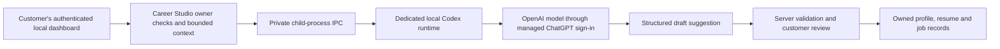

# Local ChatGPT companion

Status: September 9, 2026. Experimental local delivery for Career Studio. The compatibility baseline is the installed Codex CLI **0.153.4** and its app-server protocol. This is separate from the operator-funded OpenAI API mode and the planned ChatGPT plugin described in [Customer subscription delivery](CUSTOMER_SUBSCRIPTION_DELIVERY.md).

The companion lets an eligible customer use official Codex-managed ChatGPT sign-in on their own computer while working in the Career Studio interface. Career Studio sends bounded career context to that local runtime and receives structured suggestions. The customer still reviews profile changes and approves resume versions in Career Studio. This does not convert a ChatGPT subscription into API credits or share one subscription among hosted customers.

## Run locally

1. Install the supported Codex runtime separately. The development compatibility check used the binary included with the ChatGPT desktop app at `/Applications/ChatGPT.app/Contents/Resources/codex`; that binary is not redistributed in this repository. Confirm its version is `codex-cli 0.153.4`. Other versions require compatibility and security review before enabling the companion.
2. Install the application's dependencies with `npm ci` using the Node version required by `package.json`.
3. Enable local companion mode with `LOCAL_COMPANION=1` in local configuration, then start the application with `npm run start:companion`. Keep this mode on the customer's own computer. Do not use the switch to create a hosted or multi-customer subscription service.
4. Open the local application, sign into the intended Career Studio account, and use the ChatGPT connection control. Finish sign-in in the official OpenAI browser flow. Career Studio must never request an OpenAI password, cookie, copied access token, auth-cache file, or API key for this connection.
5. Run the career interview, inspect each suggestion, and approve only accurate evidence. Disconnect before another person uses the local installation. Ending the runtime discards its in-memory authentication; signing in again is expected after restart.

The demo remains available without connecting a provider and uses scripted replies. Companion availability, model access, and usage limits depend on the customer's actual account and workspace. An unavailable or exhausted subscription must produce a visible error; it must not silently switch to the operator's API account.

## Data and authority boundary

The Career Studio account owns the connection. The active connection and each in-flight request must be bound to the server-verified account, with a valid authenticated session required for each private request; a browser-supplied owner ID cannot select them. Account switching, logout, disconnect, deletion, and application shutdown must be tested for invalidation, cancellation, and runtime termination. Never return one owner's late result to another owner.

Use a fresh, private `CODEX_HOME`, empty working directory, and explicit environment-variable allowlist. Do not load the developer's default Codex directory, saved conversations, plugin configuration, credentials, or shell environment. Spawn the pinned executable directly with argument arrays and private standard-input/standard-output pipes. Do not interpolate user content into a command, expose the app-server socket publicly, or forward arbitrary app-server methods from the browser.

Authentication uses `cli_auth_credentials_store = "ephemeral"`: provider credentials remain in the child process for its lifetime. Threads use `ephemeral: true` and are not resumed or archived. **This does not mean that the whole runtime is disk-free.** The verified startup created runtime metadata, logs, caches, and scaffolding in its dedicated directory. Career Studio's approved records also remain in its normal database. Minimize and redact diagnostics, remove the dedicated runtime directory after termination, and do not promise secure erasure or zero provider retention. OpenAI's retention controls apply to context sent to its service. [Authentication documentation](https://learn.chatgpt.com/docs/auth)

## Enforced runtime restrictions

The integration is limited to generating career suggestions from the context supplied by the application. Job-feed retrieval, document extraction, record writes, and customer approvals remain application services. The model must not execute shell commands, read or write customer files, control a browser or desktop, call MCP/connector tools, install plugins, or start remote agents.

The primary capability restriction is **`environments: []` on both `thread/start` and every `turn/start`**. In the pinned source this removes the execution, patch, image-file-reading, and permission-request handlers from the registry, even when a model advertises them. This is an implementation boundary, independent of a prompt telling the model to behave. `dynamicTools: []` alone only removes client-supplied tools. The tagged source includes a test asserting that empty environments make those handlers both unavailable to the model and unregistered. [Pinned tool-registration test](https://github.com/openai/codex/blob/rust-v0.153.4/codex-rs/core/src/tools/spec_plan_tests.rs#L1135)

Keep the following controls together:

- Disable shell, browser, desktop, apps/connectors, plugins, remote tools, image generation, skill discovery/install, hooks, memories, sleep, and multi-agent capabilities. Set `agents.enabled = false` as well as the relevant feature settings. Disable web search explicitly with `web_search = "disabled"`. Do not configure MCP servers, dynamic tools, selected capability roots, or runtime workspace roots.
- Use `--strict-config`, `approval_policy = "never"`, and `approvals_reviewer = "user"`. An approval policy is not a tool deny-list; capability removal remains necessary.
- Select the application-controlled `jobox_no_tools` permissions profile. It declares `":root" = "deny"` in its filesystem table and `enabled = false` in its network table. Do not combine the named `permissions` field with legacy `sandbox` or `sandboxPolicy` fields. Inspect the returned `activePermissionProfile.id` before any turn.
- Disable automatic project instructions with `project_doc_max_bytes = 0`; disable bundled skill instructions and host skill discovery. Require empty instruction sources and the intended working directory when the thread starts.
- Treat any command, file-change, permission, dynamic-tool, or MCP request as a policy violation. Deny it and stop the request/runtime. Reject unknown server requests; do not invent permissive responses. This is defense in depth, not a replacement for preventing tool registration.
- Enforce request and response size limits, timeouts, cancellation, one owned request at a time, and independent validation of the structured result. Treat resume text and postings as untrusted data. A model response cannot approve its own proposed edits.

Do not claim that this protocol offers a universal `tools: []` switch. It does not. Some model metadata can select utility tools such as current-time or user-input helpers. The integration must reject unexpected requests and review effective capabilities when changing runtimes or models. The tested version's legacy `readOnly` sandbox schema contains `type` and `networkAccess`; it does **not** contain the newer `access`/`readableRoots` fields shown in some current documentation. Unknown fields are not a security control. [Pinned registry implementation](https://github.com/openai/codex/blob/rust-v0.153.4/codex-rs/core/src/tools/spec_plan.rs)

## Protocol contract for the engineer

Initialize once per child process with `clientInfo` and `capabilities.experimentalApi: true`, wait for the successful response, then send the `initialized` notification. Confirm the returned version and dedicated Codex-home path. Use the schemas generated by the pinned executable rather than assuming a newer documentation example matches it.

A new request creates an ephemeral thread with the controlled working directory, `permissions: "jobox_no_tools"`, `approvalPolicy: "never"`, `approvalsReviewer: "user"`, and empty `environments`, `dynamicTools`, `selectedCapabilityRoots`, and `runtimeWorkspaceRoots`. Verify the response before sending user context. Each turn repeats the empty environments and owned permissions, uses text input only, and supplies the application's JSON `outputSchema`. That schema applies only to the current turn.

Use `account/login/start` with `type: "chatgpt"` for managed authentication. Validate the returned sign-in URL before opening it: HTTPS, an exact supported official origin/path, no user-info, and no unexpected port. The pinned runtime's normal initial URL is `https://auth.openai.com/oauth/authorize`; Codex manages its own local callback and token exchange. The observed managed flow requests `openid`, `profile`, `email`, `offline_access`, `api.connectors.read`, and `api.connectors.invoke`. Explain these scopes before the customer continues; this application disables connector tools, but that does not narrow the provider-granted OAuth scopes. Do not silently substitute a broader or different login flow. Correlate `account/login/completed` with the expected login ID, and require a successful account state before inference. Do not implement the `chatgptAuthTokens` login variant: the installed schema marks it for internal use only. Do not proxy provider tokens to Career Studio's hosted backend. [Pinned login implementation](https://github.com/openai/codex/blob/rust-v0.153.4/codex-rs/login/src/server.rs)

Collect assistant text from `item/completed` messages belonging to the expected thread and turn. An `agentMessage` with `phase: "final_answer"` is a final-answer candidate; absent phase needs deliberate legacy handling. Do not treat a text delta, commentary message, or successful `turn/start` response as completion. Accept a result only after `turn/completed` reports `status: "completed"` and the final JSON passes the application schema and business rules. An interrupted, failed, mismatched, malformed, or timed-out turn must not mutate the profile.

`thread/tokenUsage/updated` reports the expected thread/turn's `tokenUsage.last` and `tokenUsage.total`, with input, cached input, output, reasoning output, and total token counts. These are usage measurements, not a dollar charge or the customer's remaining subscription allowance. Present unavailable quota information as unavailable.

## Verified evidence and release gates

On September 9, the installed 0.153.4 executable successfully generated its experimental JSON schemas and completed isolated standard-input initialization and ephemeral thread creation with the above restrictions. A second probe used the repository's real `Runtime` class and configuration, verified the canonical dedicated home, created the restricted ephemeral thread, received `status: "unsubscribed"` from `thread/unsubscribe`, and confirmed directory cleanup after termination. The thread had no persisted path, empty instruction sources, empty runtime roots, and the expected `jobox_no_tools` permission profile. These checks used fresh directories without reading existing credentials, signing in, or making a model request.

Those checks do **not** establish a working live subscription interview. Before advertising that experience, complete an explicit consenting-user pilot covering managed sign-in, actual account eligibility, interview output, JSON validation, review/approval, job assessment, limits, cancellation, disconnect, restart, and user switching. Record the runtime version and results. Test malicious resume/posting content and direct unauthorized calls, including cross-account results, unknown server requests, and attempted tool execution. Automated mocks are useful but do not replace this pilot.

OpenAI currently labels app-server experimental and unsupported for production workloads. A signed installer, supported runtime distribution and update strategy, rollback, current terms/support review, privacy disclosures, and a successful pilot remain release gates. Do not enable this companion in the public SaaS deployment or describe it as production-ready merely because local startup works. [App-server documentation](https://learn.chatgpt.com/docs/app-server)

Preserve the existing [design theme](DESIGN_HANDOFF.md), [security boundaries](SECURITY.md), and [operations requirements](OPERATIONS.md). The API-funded SaaS service and planned ChatGPT plugin remain separate delivery choices with their own release gates.
